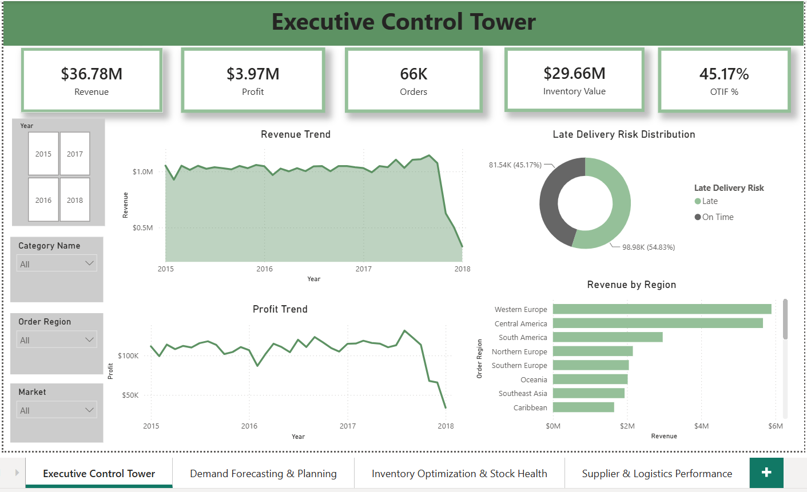
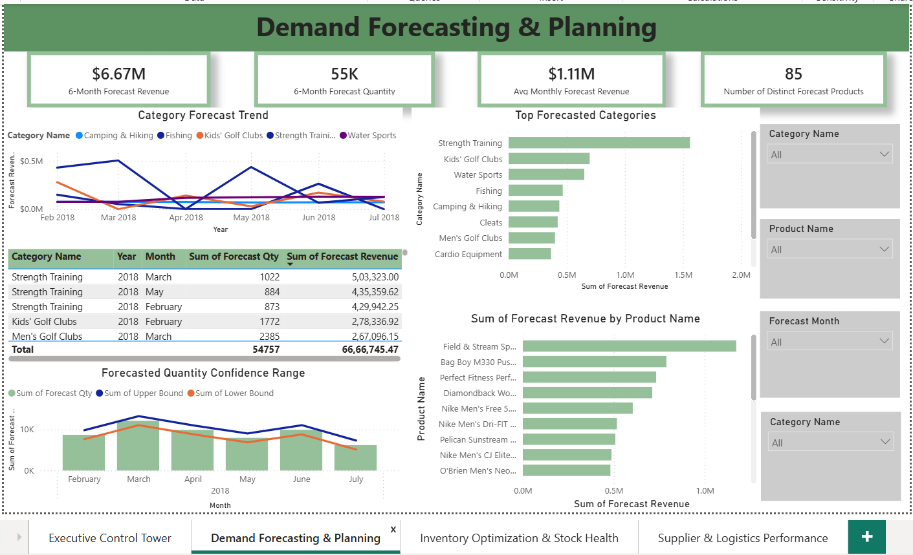
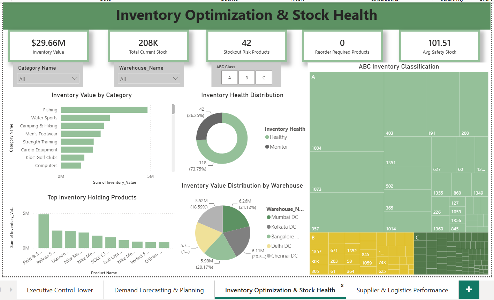
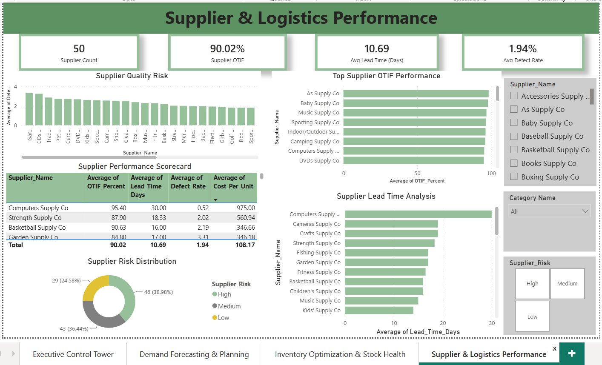

# Supply Chain Control Tower Dashboard – Demand Forecasting, Inventory Optimization & Supplier Analytics

# Supply Chain Control Tower Dashboard

## Dashboard Preview

### Executive Control Tower

### Demand Forecasting & Planning

### Inventory Optimization & Stock Health

### Supplier & Logistics Performance

## Project Overview

This project presents an end-to-end Supply Chain Analytics solution developed using Power BI and Python. The solution combines historical order data, inventory information, supplier performance metrics, and machine learning-based demand forecasts to provide a centralized Executive Control Tower for strategic decision-making.

The dashboard enables stakeholders to monitor operational performance, forecast future demand, optimize inventory levels, evaluate supplier performance, and identify potential supply chain risks.

---

## Business Problem

Supply chain organizations generate large volumes of transactional, inventory, and logistics data. Decision-makers often struggle to obtain a consolidated view of:

* Revenue and profitability trends
* Inventory health and stockout risks
* Future product demand
* Supplier performance and delivery reliability
* Regional performance and operational bottlenecks

This project addresses these challenges by integrating multiple data sources into a single analytical platform.

---

## Dataset Used

### Primary Dataset

DataCo Smart Supply Chain Dataset

Source:
https://www.kaggle.com/datasets/shashwatwork/dataco-smart-supply-chain-for-big-data-analysis

The dataset contains:

* Customer Orders
* Product Information
* Sales Transactions
* Shipping Information
* Regional Data
* Profitability Metrics

Approximate Size:

* 180,000+ transactions
* Multiple product categories
* Multiple geographic regions

---

## Additional Datasets Created

### Supplier_Master

Created to simulate supplier performance data.

Fields:

* Supplier ID
* Supplier Name
* Product Card ID
* Lead Time Days
* OTIF Percent
* Defect Rate
* Cost Per Unit

Purpose:

* Supplier performance monitoring
* Lead time analysis
* Supplier reliability assessment

---

### Inventory_Master

Created to simulate warehouse inventory data.

Fields:

* Product Card ID
* Product Name
* Category Name
* Warehouse ID
* Warehouse Name
* Current Stock
* Safety Stock
* Reorder Point
* Unit Price
* Inventory Value

Purpose:

* Inventory optimization
* Stockout risk monitoring
* Inventory valuation
* Warehouse-level analysis

---

## Demand Forecasting

Two forecasting datasets were generated using Python.

### Forecast_Category

Forecasts demand and revenue at category level.

### Forecast_Product

Forecasts demand and revenue at product level.

Forecast Horizon:

* 6 Months

---

## Forecasting Methodology

### Model Used

Prophet

Developed by Meta (Facebook).

Reasons for Selection:

* Handles seasonality effectively
* Robust to missing values
* Suitable for business forecasting
* Easy interpretation of forecast outputs
* Widely used in retail and supply chain demand planning

Inputs:

* Historical order quantity
* Historical revenue
* Monthly aggregated demand

Outputs:

* Forecast Quantity
* Forecast Revenue
* Lower Confidence Bound
* Upper Confidence Bound

---

## Data Model

The dashboard follows a star schema architecture.

### Fact Table

DataCoSupplyChainDataset

### Dimension Tables

* Calendar
* Dim_Product
* Dim_Category
* Supplier_Master
* Inventory_Master
* Forecast_Product
* Forecast_Category

Relationships were designed to support scalable filtering and analytical flexibility.

---

## DAX Measures

### Revenue

Total sales generated.

### Profit

Total profit generated from orders.

### Orders

Total number of unique customer orders.

### Quantity Sold

Total units sold.

### AOV

Average Order Value.

### OTIF %

On-Time-In-Full service level metric.

Measures percentage of orders delivered without delay.

### Inventory Value

Total monetary value of inventory held across warehouses.

### Avg Lead Time

Average supplier lead time.

### Supplier OTIF

Average supplier delivery reliability.

### Forecast Revenue

Projected revenue for future periods.

### Forecast Quantity

Projected demand volume for future periods.

---

# Dashboard Pages

## 1. Executive Control Tower

Purpose:

Provide an executive-level overview of supply chain performance.

KPIs:

* Revenue
* Profit
* Orders
* Inventory Value
* OTIF %

Visuals:

* Revenue Trend
* Profit Trend
* Revenue by Region
* Late Delivery Risk Distribution

Business Value:

Enables leadership teams to monitor operational performance and identify areas requiring intervention.

---

## 2. Demand Forecasting & Planning

Purpose:

Support future inventory and demand planning decisions.

KPIs:

* Forecast Revenue
* Forecast Quantity
* Average Monthly Forecast Revenue
* Forecasted Products

Visuals:

* Category Forecast Trend
* Top Forecasted Categories
* Product Forecast Analysis
* Forecast Confidence Range

Business Value:

Helps organizations anticipate future demand and align inventory and procurement strategies.

---

## 3. Inventory Optimization & Stock Health

Purpose:

Improve inventory efficiency and reduce stockout risk.

KPIs:

* Inventory Value
* Current Stock
* Stockout Risk Products
* Average Safety Stock

Visuals:

* Inventory Value by Category
* Inventory Health Distribution
* Warehouse Inventory Distribution
* Top Inventory Holding Products
* ABC Inventory Classification

Business Value:

Supports inventory optimization, working capital management, and warehouse performance monitoring.

---

## Key Business Insights Generated

* Regional revenue concentration identified across global markets.
* Demand forecasting provides visibility into future inventory requirements.
* ABC analysis highlights high-value inventory requiring closer monitoring.
* Inventory health segmentation enables proactive stock management.
* OTIF metrics support service level monitoring and operational improvement.

---

## Technology Stack

Power BI

* Data Modeling
* DAX
* Interactive Dashboards
* KPI Development

Python

* Pandas
* Prophet
* Time-Series Forecasting

Excel

* Data Preparation
* Master Data Creation

---

## Author

Chandan Shah

Analytics | Supply Chain Analytics | Business Intelligence | Forecasting | Data Visualization
# Supply-Chain-Control-Tower-Dashboard
End-to-End Supply Chain Analytics Dashboard featuring Demand Forecasting, Inventory Optimization, Supplier Performance Analytics and Executive KPI Monitoring using Power BI and Python.
